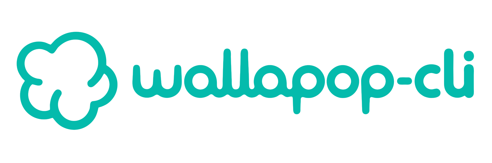

<p align="center">
  
</p>

<p align="center">
  <a href="https://github.com/Microck/wallapop-cli/releases"></a>
  <a href="https://www.npmjs.com/package/wallapop-cli"></a>
  <a href="https://github.com/Microck/wallapop-cli/actions/workflows/ci.yml"></a>
  <a href="LICENSE"></a>
</p>

---

`wallapop` is a terminal cli for wallapop that lets you search with every filter the web has, watch searches, items, and sellers for changes, and chat with sellers, all from your own account. it compiles to one static Go binary. output is json by default so everything pipes into `jq`. `--format pretty` is for humans.

[documentation](https://wallapop.micr.dev/docs) | [npm](https://www.npmjs.com/package/wallapop-cli) | [github](https://github.com/Microck/wallapop-cli)

## why

if you already use wallapop and want it in the terminal, this cli gives you a practical path without the browser. search once and keep the results as a stream of events, talk to sellers from your own account, and use every filter the site offers, all from one static binary with no daemon. output is json by default, so scripts, agents, and shell pipelines all read the same thing.

## quickstart

### linux or macos

install the binary with curl:

```bash
curl -fsSL https://raw.githubusercontent.com/Microck/wallapop-cli/main/scripts/install.sh | sh
wallapop --version
```

the installer places `wallapop` in `~/.local/bin` (override with `WALLAPOP_INSTALL_DIR`).

### windows

install via scoop:

```powershell
scoop bucket add microck https://github.com/Microck/scoop-bucket
scoop install wallapop
wallapop --version
```

### using a package manager

```bash
# homebrew
brew install Microck/tap/wallapop

# npm
npm install -g wallapop-cli

# arch linux (aur)
yay -S wallapop-cli-bin
```

### go install

```bash
go install github.com/Microck/wallapop-cli/cmd/wallapop@latest
wallapop --version
```

every release ships `checksums.txt` with a github provenance attestation:

```sh
gh release download --repo Microck/wallapop-cli --pattern checksums.txt
gh attestation verify checksums.txt --repo Microck/wallapop-cli
```

check that the install works:

```bash
wallapop --version
wallapop doctor
```

`doctor` checks that the config parses, the session mints, wallapop is reachable, and the cli can fetch the chat token.

### auth

wallapop keeps your login in an http-only browser cookie, so the cli imports it instead of asking for a password. password, google, apple, and facebook accounts all work the same way.

1. log in at es.wallapop.com in your browser
2. export cookies as a netscape/text file with an extension such as cookie-editor, or copy the value of `__Secure-next-auth.session-token`
3. run `wallapop auth login` and paste the file path or the value, or pass `--cookies FILE`

```bash
# interactive prompt (paste cookie value or file path)
wallapop auth login

# import from an exported cookie file
wallapop auth login --cookies ~/Downloads/cookies.txt

# read from stdin
cat cookies.txt | wallapop auth login --cookies-stdin
```

the cli keeps only that cookie and your device id, in a 0600 file under `~/.config/wallapop-cli/credentials.toml`. it mints short-lived access tokens itself, the same way the web does, and re-saves the cookie as wallapop rotates it. the session slides 30 days on every authenticated command. your account location becomes the default search centre.

check session status or verify credentials:

```bash
wallapop auth status
wallapop auth refresh
```

run multiple accounts side by side using profiles:

```bash
wallapop auth login --cookies alt.txt --profile alt
wallapop profile list
wallapop profile use alt
wallapop search "bici" --profile alt
```

for ci, pass `WALLAPOP_SESSION_TOKEN` in the environment so the cli writes no credentials file to disk:

```bash
export WALLAPOP_SESSION_TOKEN="..."
wallapop search "bici" --format jsonl
```

## auth model

| credential | where it comes from | what it unlocks |
|---|---|---|
| none | | `search`, `item show`, `user *`, `category list`, watches on public data |
| session cookie | browser export via `auth login` | favorites, own listings, chat, `me *` |
| `WALLAPOP_SESSION_TOKEN` | environment, for ci | same as above, never written to disk |

## command surface

| command | what it does |
|---|---|
| `auth login / status / refresh / logout` | import, inspect, renew or forget a session (slides 30 days on every authenticated command) |
| `profile list / use / remove` | several accounts side by side |
| `search [keywords] [--filter k=v]...` | search around your location; `search filters` lists valid keys |
| `category list` | category ids |
| `alert list` | your saved searches on wallapop; `watch add search --from-alert ID --name NAME` turns one into a watch |
| `item show / open / favorite / unfavorite` | inspect a listing by hash or url |
| `item reserve / sold / delete` | act on your own listings (`sold`, `delete` ask or need `--yes`) |
| `user show / items / reviews` | look at a seller by hash, url or slug |
| `me show / items / favorites` | your account |
| `chat list / show / send / start / open / archive` | messaging; `open` is a live line-mode chat |
| `watch add search\|item\|seller` | create a watch (baselines silently, `--emit-initial` to report what exists) |
| `watch check / run / events / list / remove` | one-shot check, foreground loop, history |
| `watch service install / uninstall / status` | systemd user timer or launchd agent running `watch check` |
| `sink list / test` | notification targets from config |
| `config path / get / set / list` | config.toml |
| `doctor` | checks config, session, api, chat token, schedule |
| `skills list / get` | embedded docs for agents |
| `completion bash\|zsh\|fish\|powershell` | shell completion |

global flags: `--profile`, `--format json|jsonl|pretty|toon`, `--no-color`, `--error-format text|json`, `--no-input`, `--debug`.

## shell completion

```bash
# zsh
wallapop completion zsh > "${fpath[1]}/_wallapop"

# bash
wallapop completion bash > /etc/bash_completion.d/wallapop

# fish
wallapop completion fish > ~/.config/fish/completions/wallapop.fish

# powershell
wallapop completion powershell >> $PROFILE
```

## examples

```bash
wallapop search "thinkpad x1" --max-price 400 --sort newest --format pretty
wallapop search --category 100 --filter brand=Toyota --filter max_km=120000 --limit 20
wallapop item show https://es.wallapop.com/item/thinkpad-x1-carbon-1092837465

wallapop watch add search "thinkpad x1" --max-price 400 --name x1 --notify phone
wallapop watch check --all --format jsonl | jq -r 'select(.type=="item.price_changed") | .item.url'
wallapop watch service install --interval 10m

wallapop chat list --unread --format pretty
wallapop chat start k2j3h4g5f6d7 "Hola, ¿sigue disponible?"
echo "Te lo dejo en 200" | wallapop chat send 8f1c2 -
wallapop chat open 8f1c2
```

## sinks config

a sink is a few lines of config:

```toml
[sinks.phone]
type = "ntfy"
url = "https://ntfy.sh"
topic = "wallapop-deals"

[sinks.discord]
type = "webhook"
url = "https://discord.com/api/webhooks/..."
template = "discord"

[sinks.script]
type = "exec"
command = ["~/bin/on-wallapop-event"]   # event json on stdin
```

## exit codes

`0` ok, `1` generic, `2` usage, `3` auth, `4` not found, `5` blocked or rate limited, `6` network, `7` wallapop changed its api. stderr carries a prefilled issue link. `130` interrupted.

## building from source

```bash
git clone https://github.com/Microck/wallapop-cli && cd wallapop-cli
make build     # bin/wallapop
make check     # vet, staticcheck, tests, gofmt
```

## documentation

full docs live at [wallapop.micr.dev/docs](https://wallapop.micr.dev/docs). install, the cookie export walkthrough, the command reference generated from the binary, exit codes, sinks, and scheduling. the site source is in `docs-site`.

- [docs/cli-spec.md](docs/cli-spec.md): the interface contract and every endpoint the cli uses
- [CONTEXT.md](CONTEXT.md): vocabulary
- [docs/adr](docs/adr): decisions

## contributing

issues and pull requests are welcome. when wallapop changes something, the cli prints a prefilled issue link. that is the most useful report you can file.

## disclaimer

this is an unofficial client. wallapop has no public api for buyers, and its terms of use prohibit bots, scraping and reverse engineering. the stated remedy is account suspension. use it with an account you are willing to lose, keep the check interval reasonable, and do not use it to spam sellers. not affiliated with wallapop.

## license

[mit license](LICENSE)
